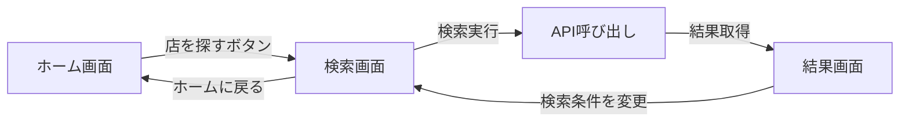

# app/page.tsx 解説

## 概要
このファイルはアプリケーションのメインページコンポーネントです。画面の状態管理と遷移ロジックを担当しています。

## コンポーネント構造

### 1. インポート部分
```typescript
'use client'  // Next.js 13+ のクライアントコンポーネント宣言

import { useState } from 'react'
import SearchForm, { SearchRequest } from './components/search/SearchForm'
import ResultsList from './components/restaurant/ResultsList'
import { Restaurant } from './components/restaurant/RestaurantCard'
```

**ポイント**:
- `'use client'`: このコンポーネントがブラウザ側で実行されることを示す
- 3つの主要コンポーネントをインポート
- 型定義（`SearchRequest`, `Restaurant`）も一緒にインポート

### 2. 型定義
```typescript
type ViewState = 'home' | 'search' | 'results'
```

**3つの画面状態**:
- `home`: トップページ（サービス説明）
- `search`: 検索フォーム画面
- `results`: 検索結果表示画面

### 3. 状態管理（State）
```typescript
const [currentView, setCurrentView] = useState<ViewState>('home')
const [searchRequest, setSearchRequest] = useState<SearchRequest | null>(null)
const [restaurants, setRestaurants] = useState<Restaurant[]>([])
```

**3つの状態**:
1. `currentView`: 現在表示中の画面
2. `searchRequest`: ユーザーが入力した検索条件
3. `restaurants`: APIから取得した店舗リスト

### 4. イベントハンドラー

#### 検索完了時の処理
```typescript
const handleSearchComplete = (request: SearchRequest, restaurantList: Restaurant[]) => {
  setSearchRequest(request)      // 検索条件を保存
  setRestaurants(restaurantList) // 店舗リストを保存
  setCurrentView('results')      // 結果画面へ遷移
}
```

#### ナビゲーション
```typescript
const handleBackToSearch = () => {
  setCurrentView('search')  // 検索画面へ戻る
}

const handleBackToHome = () => {
  setCurrentView('home')    // ホーム画面へ戻る
}
```

### 5. レンダリング部分

#### 基本構造
```typescript
return (
  <main className="min-h-screen bg-gradient-to-b from-gray-50 to-white">
    {/* 条件に応じて異なる画面を表示 */}
  </main>
)
```

#### ホーム画面（currentView === 'home'）
- サービスの説明文
- 「店を探す」ボタン → クリックで検索画面へ
- 3ステップの利用方法説明（アイコン付き）

#### 検索画面（currentView === 'search'）
- 「ホームに戻る」ボタン
- `SearchForm`コンポーネント
  - `onSearchComplete`プロパティで検索完了時の処理を渡す

#### 結果画面（currentView === 'results'）
- `ResultsList`コンポーネント
  - 検索条件（`searchRequest`）
  - 店舗リスト（`restaurants`）
  - 戻るボタンのハンドラー（`onBackToSearch`）

## データフロー



## 重要なポイント

1. **単一ページアプリケーション（SPA）**
   - URLは変わらず、状態で画面を切り替え
   - React の状態管理で画面遷移を実現

2. **プロップスドリリング**
   - 親コンポーネントから子コンポーネントへデータを渡す
   - コールバック関数で子から親へイベントを通知

3. **型安全性**
   - TypeScriptで全ての状態と関数の型を定義
   - コンパイル時にエラーを検出可能

## 改善の余地

1. **URL対応**
   - Next.jsのルーティング機能を使って各画面にURLを割り当て
   - ブラウザの戻るボタンに対応

2. **状態管理**
   - 複雑になったらContext APIやZustandなどの状態管理ライブラリを検討

3. **エラーハンドリング**
   - 検索エラー時の画面表示
   - ローディング状態の表示
